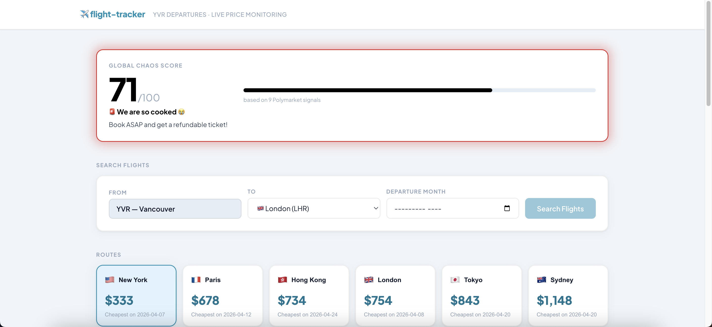

# ✈️ flight-tracker

## Overview

I love travelling!! But between global conflicts, pandemics, economic shifts, and geopolitical tensions, flight prices have never been more unpredictable. **flight-tracker** pulls real-time pricing data across multiple routes and world-event signals to build up a dataset for forecasting where prices are headed.




🌐 **[Live Demo](https://flight-tracker-pink.vercel.app)**

---

## Features

- Track cheapest fares for **6 international routes from YVR**
- Search flights by **destination and departure month**
- Calculates a **Global Chaos Score (0–100)** estimating travel instability
- Scheduled collector updates flight prices and events every **6 hours**

--- 

## Global Chaos Score

A single 0–100 score computed from a weighted average of Polymarket event probabilities. Higher-volume markets carry more weight since they represent more reliable crowd signals. Ceasefire/peace markets are inverted (low ceasefire probability = high conflict = high chaos). Oil markets are weighted by price threshold — only extreme spikes meaningfully affect flight prices.

| Score | Level | Meaning |
|-------|-------|---------|
| 60+ | 😭 We are so cooked | Book ASAP and get a refundable ticket! |
| 40+ | 🌪️ It's giving chaos | Things are getting spicy...don't wait! |
| 20+ | 👀 Sus but manageable | Could be nothing. Could be everything. Check back soon! |
| 0+ | ✌️ Calm skies | Weirdly calm, book before that changes! |

---

## Tech Stack

**Backend**
- Go
- PostgreSQL
- REST API

**Frontend**
- React
- Vite
- Recharts

**Infrastructure**
- Railway (API + scheduled collector)
- Vercel (frontend)

**Data Sources**
- Travelpayouts API — flight prices  
- Polymarket Gamma API — world-event prediction markets
---

## Getting Started

### Prerequisites

- Go 1.26+
- Node.js 18+ (for frontend)
- [Travelpayouts API token](https://travelpayouts.com) (free)

### Installation

```bash
git clone https://github.com/carissaor/flight-tracker.git
cd flight-tracker
go mod tidy
```

### Database Setup

```bash
psql postgres -c "CREATE DATABASE flight_tracker;"
psql "postgres://YOUR_USER@localhost:5432/flight_tracker" -f schema.sql
```

### Configuration

```bash
cp .env.example .env
```

```env
DATABASE_URL=postgres://YOUR_USER@localhost:5432/flight_tracker?sslmode=disable
TRAVELPAYOUTS_TOKEN=your_token_here
ORIGIN=YVR
```

### Run the Collector

```bash
go run ./cmd/collector
```

### Run the API Server

```bash
go run ./cmd/api
```

API runs on `http://localhost:8080`

### Run the Frontend

```bash
cd frontend
npm install
npm run dev
```

Frontend runs on `http://localhost:5173`

---

## API Endpoints

| Method | Endpoint | Description |
|--------|----------|-------------|
| GET | `/api/routes` | All routes with latest and lowest price |
| GET | `/api/prices?route=YVR-LHR` | Price history by departure date |
| GET | `/api/search?origin=YVR&destination=LHR&month=2026-06` | Search prices for a specific month |
| GET | `/api/events` | Latest Polymarket world-event signals |
| GET | `/api/chaos` | Global chaos score and level |

---

## Project Structure

```
flight-tracker/
├── cmd/
│   ├── api/
│   │   └── main.go          # REST API server with DB caching
│   └── collector/
│       └── main.go          # Price + event collector (runs every 6h on Railway)
├── frontend/                # React dashboard (Vite)
│   └── src/
│       ├── components/      # ChaosScore, RouteCard, PriceChart, EventsPanel, SearchPanel
│       └── constants.js     # Shared destination labels and emojis
├── schema.sql               # Database table definitions
├── Dockerfile               # API server Docker build
├── Dockerfile.collector     # Collector Docker build
├── go.mod
├── go.sum
└── README.md
```

---

### Future Improvements
- Price prediction model
- Flight price alerts
- Additional routes
---

## License

MIT License — see [LICENSE](LICENSE) for details.

---

## Disclaimer

Flight price predictions are based on historical data and world-event signals. They are not financial advice. Always verify prices directly with airlines or booking platforms before making travel decisions.