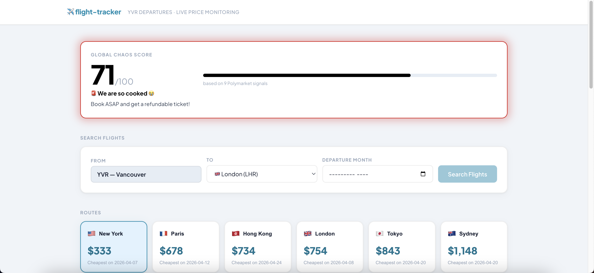

# ✈️ Turbulence

**Turbulence** is a full-stack flight-price tracking platform built with **Go, React, and PostgreSQL**. It collects airfare snapshots across international routes, tracks how prices change over time, and combines flight data with prediction-market signals to provide additional context around global travel disruption.

I built Turbulence after wondering whether events such as geopolitical conflicts, pandemics, travel restrictions, and major economic shifts could help explain changes in international airfare.

The project is designed to build a historical dataset for analyzing fare movements and, eventually, supporting more advanced price forecasting.



🌐 **[Live Demo](https://turbulence-app.vercel.app)**

---

## Features

- 🔎 Search airfare by **destination and departure month**
- 🗓️ Compare the latest known fares across upcoming departure dates
- 📈 View **price history for a specific departure date**
- 💾 Persist historical flight-price snapshots in PostgreSQL
- ✈️ Track fares across **6 international routes from YVR**
- ⚙️ Run a scheduled Go collector every **6 hours** to refresh airfare and world-event data
- 🌍 Aggregate relevant Polymarket signals into an experimental **Global Chaos Score**
- ☁️ Deploy the API and scheduled collector on Railway and the React frontend on Vercel

Currently tracked destinations include:

- London — LHR
- Tokyo — NRT
- Sydney — SYD
- Paris — CDG
- New York — JFK
- Hong Kong — HKG

---

## Architecture

Turbulence is split into independently deployed frontend, backend, database, and data-collection components.

```text
    User[User] --> Frontend[React + Vite Frontend]

    Frontend -->|REST API| API[Go API]

    API --> SearchAPI[Travelpayouts API]
    API --> DB[(PostgreSQL)]

    Collector[Scheduled Go Collector Every 6 Hours] --> TravelAPI[Travelpayouts API]
    Collector --> PolyAPI[Polymarket Gamma API]
    Collector --> DB

    DB --> API
```

### Data Flow

```text
Travelpayouts
      │
      ▼
Go API / Scheduled Collector
      │
      ▼
PostgreSQL
      │
      ▼
Go REST API
      │
      ▼
React Dashboard
```

The scheduled collector allows the application to build price history even when no user is actively searching.

--- 

## Global Chaos Score

The **Global Chaos Score** is an experimental travel-disruption indicator derived from relevant prediction markets on Polymarket.

It is **not a machine-learning model or a flight-price prediction model**.

The score provides contextual information about global events that may affect international travel.

Relevant markets are identified using topics such as:

- war and military conflict
- invasion
- nuclear risk
- pandemics and health emergencies
- travel bans
- airspace restrictions
- ceasefires and peace agreements
- financial crises and recessions
- crude oil and fuel prices

Market signals are weighted using factors including:

- prediction-market probability
- market trading volume
- uncertainty
- event type
- special handling for peace/ceasefire and oil-price markets

For example, ceasefire probabilities are inverted when calculating disruption risk:

```text
High probability of ceasefire
        ↓
Lower disruption signal

Low probability of ceasefire
        ↓
Higher disruption signal
```

Oil markets are also weighted according to the price threshold so that unusually extreme price scenarios have more influence than ordinary oil-price movements.

### Score Interpretation

| Score | Level | Interpretation |
|---|---|---|
| 60+ | 😭 We are so cooked | Book ASAP and consider a refundable ticket |
| 40–59 | 🌪️ It's giving chaos | Conditions are becoming increasingly uncertain |
| 20–39 | 👀 Sus but manageable | Some disruption signals are present |
| 0–19 | ✌️ Calm skies | Current signals indicate relatively low disruption |

---

## Tech Stack

### Backend

- **Go**
- REST API
- PostgreSQL
- External API integrations

### Frontend

- **React**
- Vite
- Axios
- Recharts
- DayPicker

### Infrastructure

- **Railway**
  - Go REST API
  - PostgreSQL
  - Scheduled data collector
- **Vercel**
  - React frontend
- **Docker**
  - Containerized backend services

### Data Sources

- **Travelpayouts API**
  - Flight-price data
- **Polymarket Gamma API**
  - Prediction-market event signals

---

## Project Structure

```text
turbulence/
│
├── cmd/
│   ├── api/
│   │   └── ...
│   │
│   └── collector/
│       └── ...
│
├── internal/
│   ├── db/
│   │   └── ...
│   │
│   ├── handlers/
│   │   ├── search.go
│   │   ├── prices.go
│   │   ├── routes.go
│   │   ├── events.go
│   │   └── chaos.go
│   │
│   ├── middleware/
│   │   └── ...
│   │
│   └── models/
│       └── ...
│
├── frontend/
│   ├── src/
│   │   ├── components/
│   │   ├── constants.js
│   │   └── ...
│   │
│   └── package.json
│
├── docs/
│   └── dashboard.png
│
├── schema.sql
├── go.mod
├── go.sum
├── .env.example
└── README.md
```

---

## API Endpoints

### Search Flights

```http
GET /api/search?origin=YVR&destination=LHR&month=2026-10
```

Searches airfare for a specific destination and departure month.

---

### Routes

```http
GET /api/routes
```

Returns tracked routes together with their latest and lowest observed prices.

---

### Departure Prices

```http
GET /api/prices?route=YVR-LHR&mode=depart
```

Returns the latest known fare for each available departure date.

---

### Price History

```http
GET /api/prices?route=YVR-LHR&mode=history&departDate=2026-10-15
```

Returns historical price observations for one specific departure date.

---

### World Events

```http
GET /api/events
```

Returns the latest relevant prediction-market signals collected from Polymarket.

---

### Global Chaos Score

```http
GET /api/chaos
```

Returns the current experimental travel-disruption score and corresponding level.

---

## Getting Started

### Prerequisites

You will need:

- Go — use the version specified in `go.mod`
- Node.js 18+
- PostgreSQL
- A Travelpayouts API token

Travelpayouts API access is available through:

[https://travelpayouts.com](https://travelpayouts.com)

---

## Installation

Clone the repository:

```bash
git clone https://github.com/carissaor/turbulence.git
cd turbulence
```

Install Go dependencies:

```bash
go mod tidy
```

---

## Database Setup

Create a local PostgreSQL database:

```bash
psql postgres -c "CREATE DATABASE flight_tracker;"
```

Apply the schema:

```bash
psql "postgres://YOUR_USER@localhost:5432/flight_tracker" -f schema.sql
```

---

## Configuration

Copy the example environment configuration:

```bash
cp .env.example .env
```

Configure the required environment variables:

```env
DATABASE_URL=postgres://YOUR_USER@localhost:5432/flight_tracker?sslmode=disable
TRAVELPAYOUTS_TOKEN=your_token_here
ORIGIN=YVR
```

Do not commit your real `.env` file or API credentials.

---

## Running Locally

### Run the Collector

```bash
go run ./cmd/collector
```

The collector retrieves:

- airfare observations from Travelpayouts
- relevant prediction markets from Polymarket

and stores the results in PostgreSQL.

---

### Run the API Server

```bash
go run ./cmd/api
```

The API runs by default at:

```text
http://localhost:8080
```

---

### Run the Frontend

Open a second terminal:

```bash
cd frontend
npm install
npm run dev
```

The frontend runs by default at:

```text
http://localhost:5173
```

Make sure the frontend's `VITE_API_URL` points to the local Go API when developing locally.

---

## Deployment

The production application currently uses a multi-service deployment architecture.

### Frontend

The React/Vite frontend is deployed on:

```text
Vercel
```

### Backend

The Go REST API is deployed on:

```text
Railway
```

### Database

Historical airfare and prediction-market observations are stored in:

```text
PostgreSQL
```

### Scheduled Collection

A scheduled collector runs approximately every six hours to refresh airfare and world-event observations.

This allows price history to grow independently of user searches.

---

## Roadmap

### Completed

- [x] React flight-search interface
- [x] Go REST API
- [x] PostgreSQL price persistence
- [x] Historical price snapshots
- [x] Departure-date price comparison
- [x] Price-history visualization
- [x] Scheduled airfare collector
- [x] Polymarket event collection
- [x] Global Chaos Score
- [x] Dockerized backend services
- [x] Railway backend deployment
- [x] Vercel frontend deployment

### Planned

- [ ] User watchlists
- [ ] Target-price alerts
- [ ] Authentication and user-specific tracking
- [ ] Improved collector observability and health checks
- [ ] Database indexing and snapshot deduplication strategy
- [ ] AWS deployment using services such as ECS/Fargate, EventBridge, and CloudWatch
- [ ] Additional international routes
- [ ] Experimental airfare forecasting model

---

## License

This project is licensed under the MIT License.

See [LICENSE](LICENSE) for details.

---

## Disclaimer

Turbulence is an experimental software project intended for educational and informational purposes.

The Global Chaos Score is a heuristic indicator and should not be interpreted as a prediction of future airfare, geopolitical events, financial markets, or travel safety.

Flight prices displayed by the application may change at any time and should always be verified directly with airlines or booking platforms before making a purchase or travel decision.